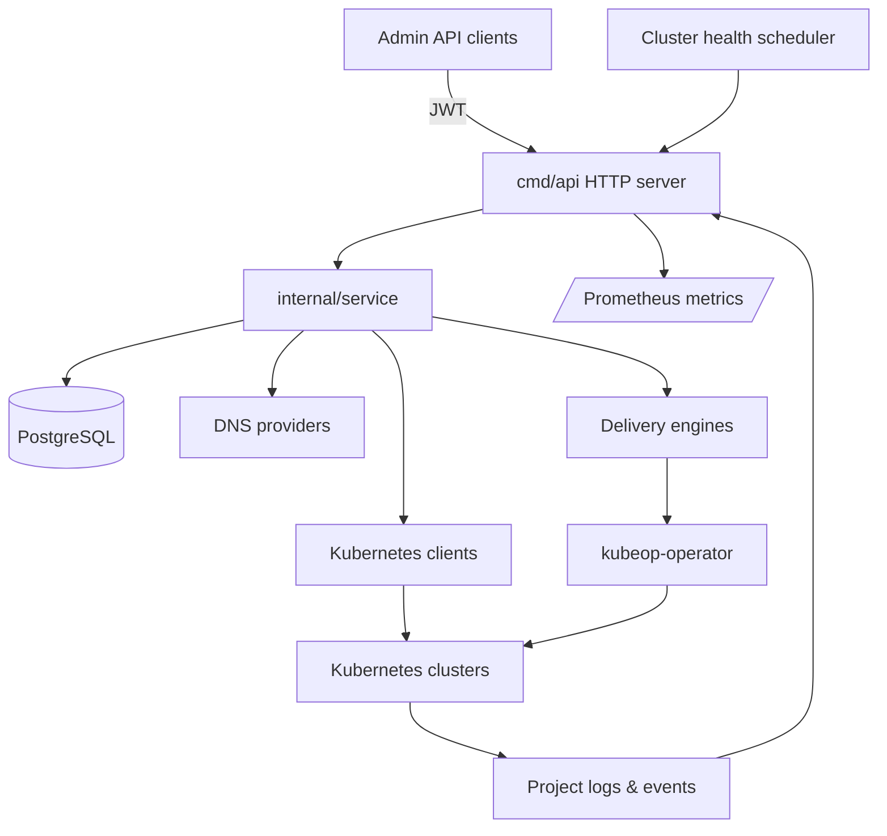

# kubeOP

[](https://github.com/vaheed/kubeOP/actions/workflows/ci.yml "Latest CI run")
[](https://vaheed.github.io/kubeOP "Browse the documentation")
[](LICENSE "Apache 2.0 license")

> kubeOP is an out-of-cluster control plane that lets platform teams register Kubernetes clusters, bootstrap tenants, and ship
> applications through a single API.

## Table of contents

- [Overview](#overview)
- [Key capabilities](#key-capabilities)
- [Architecture at a glance](#architecture-at-a-glance)
- [Quickstart](#quickstart)
- [Operator bootstrap CLI](#operator-bootstrap-cli)
- [Documentation map](#documentation-map)
- [Contributing & support](#contributing--support)

## Overview

kubeOP runs outside the clusters it manages. An API binary exposes REST endpoints for cluster onboarding, tenant lifecycle, and
application delivery. A lightweight in-cluster operator applies rendered manifests and reports status back to the control plane.
Together they provide multi-cluster governance without installing per-cluster control planes.

The project ships with a reference PostgreSQL schema, a scheduler that records cluster health, and composable delivery engines for
container images, Helm charts, raw manifests, Git repositories, and OCI bundles. Authentication is handled with a short-lived
administrator JWT secret, and all kubeconfigs are encrypted at rest using an AES-GCM key derived from `KCFG_ENCRYPTION_KEY`.

## Key capabilities

- **Cluster registry** – store encrypted kubeconfigs, set metadata (owner, environment, region), and run scheduled health checks
to track readiness across fleets.
- **Tenant automation** – bootstrap users, namespaces, and default projects with quota defaults driven by configuration so new
teams onboard consistently.
- **Application delivery** – deploy workloads from images, Helm charts, Git sources, or OCI bundles with deterministic labels,
render previews, and release history including SBOM metadata.
- **Credential & secret management** – store Git and registry credentials, manage configmaps/secrets per project, and attach them
to apps through the API. Service bindings explicitly support `app` and `serviceAccount` consumers with `database`, `cache`, and `queue`
providers so tenants can reason about allowed integrations.
- **Maintenance controls** – toggle maintenance mode with audit logs to pause mutating APIs during upgrades.
- **Observability hooks** – scrape `/metrics`, fetch project and app logs, and ingest Kubernetes events for a unified operational
picture.
- **Billing usage snapshots** – aggregate CPU, memory, storage, egress, and load-balancer hours into hourly `BillingUsage`
  resources and surface live tenant/project totals via printer columns.

## Architecture at a glance



- `cmd/api` provides the HTTP server, configuration loader, logging bootstrap, database migrations, and the cluster health
  scheduler.
- `internal/service` coordinates persistence, Kubernetes interactions, DNS automation, and delivery workflows.
- `internal/store` wraps PostgreSQL with migrations embedded via `golang-migrate` and connection pool tuning.
- `kubeop-operator` is a separate manager that reconciles the `App` custom resource and surfaces pod/ingress status to the API.

## Quickstart

Follow the full [Quickstart](docs/QUICKSTART.md) for copy-pasteable commands. The short version:

1. **Clone and bootstrap**

   ```bash
   git clone https://github.com/vaheed/kubeOP.git
   cd kubeOP
   cp docs/examples/docker-compose.env .env
   mkdir -p logs
   ```

2. **Start the stack**

   ```bash
   docker compose --file docs/examples/docker-compose.yaml --env-file .env up -d --build
   ```

3. **Check health**

   ```bash
   curl http://localhost:8080/healthz
   curl http://localhost:8080/v1/version | jq
   ```

   > **Note:** Local development builds report `0.0.0-dev` as the version when release metadata isn't provided via build flags. Tagged releases continue to surface their semantic version.
   >
   > To embed release data in ad-hoc builds, pass ldflags that override the default metadata variables:
   >
   > ```bash
   > go build -ldflags "-X github.com/vaheed/kubeOP/internal/version.rawVersion=0.15.5 \
   >   -X github.com/vaheed/kubeOP/internal/version.rawCommit=$(git rev-parse --short HEAD) \
   >   -X github.com/vaheed/kubeOP/internal/version.rawDate=$(date -u +%Y-%m-%dT%H:%M:%SZ)" \
   >   ./cmd/api
   > ```

4. **Authenticate and register a cluster**

   ```bash
   export KUBEOP_TOKEN="<admin-jwt>"
   ./docs/examples/curl/register-cluster.sh
   ```

   The API listens on `http://localhost:8080` by default. Logs write to `./logs`. See [docs/TROUBLESHOOTING.md](docs/TROUBLESHOOTING.md)
for common fixes.

  > **Managed cluster bootstrap:** The operator now ensures the App CRD exists before the controller starts. Make sure the
  > `kubeop-operator` service account can `get`, `create`, `update`, and `patch` the `customresourcedefinitions` resource in the
  > `apiextensions.k8s.io` API group. Helper manifests such as `kustomization.yaml` are ignored during bootstrap so the
  > controller never attempts to install empty-named resources from embedded bases. If your automation forbids controllers from
  > creating CRDs, apply the manifest manually before rolling out the deployment:
   >
   > ```bash
   > kubectl apply -f kubeop-operator/config/crd/bases/kubeop.io_apps.yaml
   > ```

5. **(Optional) Enforce registry allowlists**

   ```bash
   kubectl -n <tenant-namespace> apply -f samples/registry-policy-configmap.yaml
   ```

   The admission webhook blocks container images and Helm/OCI sources that are not listed in the namespace's `registry-policy`
   ConfigMap. See [docs/apps/security.md](docs/apps/security.md) for key formats and rollout guidance.

## Operator bootstrap CLI

The `kubeop-bootstrap` binary (built from `kubeop-operator/cmd/bootstrap`) installs the platform CRDs, RBAC, webhooks, and default tenant artefacts. It emits CloudEvents on stderr for audit trails, writes applied objects under `./out/`, and defaults to tabular output. Set `--output yaml` for machine-readable responses and supply `--yes` to perform changes.

```bash
go build -o bin/kubeop-bootstrap ./kubeop-operator/cmd/bootstrap

# Install CRDs, webhooks, and RBAC
bin/kubeop-bootstrap init --yes

# Seed default runtime, network, and billing profiles
bin/kubeop-bootstrap defaults --yes

# Create tenants and projects
bin/kubeop-bootstrap tenant create --name acme --billing-account BA-001 --display-name "Acme Corp" --yes
bin/kubeop-bootstrap project create --name web --namespace web-prod --tenant acme --purpose "Customer web" --environment prod --yes

# Attach domains and registry credentials
bin/kubeop-bootstrap domain attach --name acme-main --fqdn apps.acme.test --tenant acme --dns-provider external-dns --certificate-policy letsencrypt-prod --yes
bin/kubeop-bootstrap registry add --name acme-harbor --tenant acme --secret harbor-credentials --type harbor --yes
```

> The CLI automatically installs the bundled CRDs before applying other manifests and defaults the project environment to `dev` when `--environment` is omitted.

Operator assets stay reproducible through the dedicated Makefile targets (run `make -C kubeop-operator tools` once to install the `controller-gen` and `kubeconform` helpers; ensure `kubectl` is present on your `PATH`):

```bash
make -C kubeop-operator tools      # install validation prerequisites
make -C kubeop-operator crds       # regenerate CRDs and deepcopy helpers
make -C kubeop-operator validate   # run kubeconform against the default overlay
make -C kubeop-operator install    # apply CRDs + RBAC + webhooks into the current cluster
make -C kubeop-operator uninstall  # clean up the installed resources
```

Refer to [docs/CRDs.md](docs/CRDs.md) for a condensed reference to every kubeOP platform resource.

## Security defaults

- **Helm chart allow-list & HTTPS enforcement** – Set `HELM_CHART_ALLOWED_HOSTS` to a comma-separated list of trusted domains.
  Helm chart downloads now require HTTPS on port 443, reject userinfo/fragment components, block IP literals and private
  networks, and cap redirects plus response size. Requests that fall outside these guardrails are rejected before any network
  dial, closing the CodeQL SSRF findings for user-provided chart URLs.
- **Git repository confinement** – Git delivery paths are normalised via `pkg/security` helpers that resolve symlinks, reject
  encoded traversal, control characters, backslashes, and drive letters, and ensure every filesystem access remains inside the
  cloned repository. This mitigates the CodeQL path traversal alerts (#17, #18).
- **Tenant-scoped admission control** – Mutating and validating webhooks ensure every namespace-scoped resource carries the
  `paas.kubeop.io/{tenant,project,app}` labels, block cross-tenant references, and reject privileged Jobs unless they provide a
  `paas.kubeop.io/run-as-root-justification` annotation. See [docs/security/tenancy.md](docs/security/tenancy.md) for examples.
- **Service exposure policy** – Projects referencing a `NetworkPolicyProfile` inherit a service policy that allow-lists
  `Service` types and external IPs. Apps requesting a `LoadBalancer` or static IP outside the profile are rejected by the
  webhook before they reach the API server.
- **Tenant RBAC automation** – The operator ships `tenant-owner`, `tenant-developer`, and `tenant-viewer` ClusterRoles and the
  `TenantReconciler` auto-provisions RoleBindings in every namespace labelled with `paas.kubeop.io/tenant=<name>`. Namespace
  label changes are watched directly, so freshly created or newly labelled namespaces receive bindings without requiring manual
  requeues. The bindings target the groups `tenant:<tenant>:{owners,developers,viewers}` so kubeconfigs issued to tenants cannot
  read or mutate other namespaces.
- **Event bridge opt-in** – The `/v1/events/ingest` endpoint is available only when `EVENT_BRIDGE_ENABLED=true`. The legacy
  `K8S_EVENTS_BRIDGE` alias was removed in v0.15.0 to avoid confusion around partially-enabled deployments.

## Documentation map

| Topic | Description |
| --- | --- |
| [Quickstart](docs/QUICKSTART.md) | 10-minute local bootstrap including curl samples. |
| [Install](docs/INSTALL.md) | Supported installation paths, prerequisites, and version matrix. |
| [Environment](docs/ENVIRONMENT.md) | Complete configuration reference sourced from `internal/config.Config`. |
| [Architecture](docs/ARCHITECTURE.md) | Control plane, data flow, and operator diagrams with Mermaid sources. |
| [API](docs/API.md) | Endpoint catalogue, request/response schemas, and examples. |
| [CLI](docs/CLI.md) | Building and running the `kubeop` binary plus management scripts. |
| [Operations](docs/OPERATIONS.md) | Backups, upgrades, migrations, HA, and observability guidance. |
| [Security](docs/SECURITY.md) | Threat model, RBAC posture, secrets handling, disclosure policy. |
| [Security / Tenancy](docs/security/tenancy.md) | Label policy, webhook enforcement, and tenant validation workflows. |
| [App security](docs/apps/security.md) | App release immutability and registry/Helm source allowlists. |
| [Troubleshooting](docs/TROUBLESHOOTING.md) | Symptom → cause → fix with commands. |
| [FAQ](docs/FAQ.md) | Answers to common adoption questions. |
| [Glossary](docs/GLOSSARY.md) | Shared terminology for contributors and operators. |
| [Roadmap](docs/ROADMAP.md) | Time-boxed milestones with acceptance criteria and risks. |
| [CRDs](docs/CRDs.md) | Summary of kubeOP custom resources, spec fields, and status surfaces. |
| [Billing usage](docs/billing/usage.md) | Usage Writer controller flow, hourly snapshots, and troubleshooting tips. |
| [Style guide](docs/STYLEGUIDE.md) | Authoring standards plus lint tooling. |

## Contributing & support

- Start with [CONTRIBUTING.md](CONTRIBUTING.md) for development environment setup, coding standards, and the PR checklist.
- Run `make fmt`, `go vet ./...`, `go test ./...`, `go test -count=1 ./testcase`, `npm run docs:lint`, and `npm run docs:build` before pushing.
- File issues or support requests via [SUPPORT.md](SUPPORT.md). Security reports should follow the contact guidance in
  [docs/SECURITY.md](docs/SECURITY.md).

kubeOP is licensed under the [Apache License 2.0](LICENSE).
