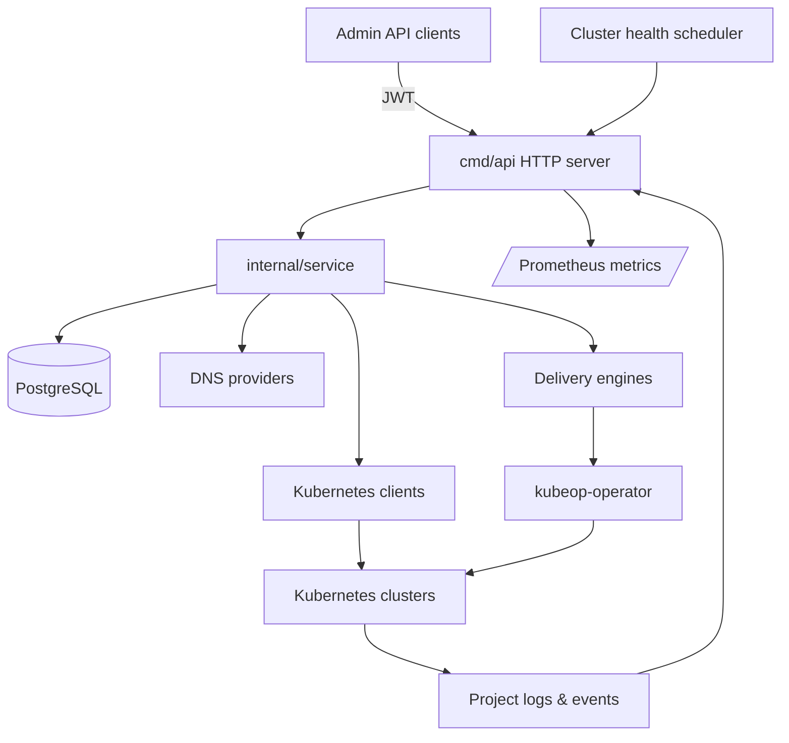

# kubeOP

[](https://github.com/vaheed/kubeOP/actions/workflows/ci.yml "Latest CI run")
[](https://vaheed.github.io/kubeOP "Browse the documentation")
[](LICENSE "Apache 2.0 license")

> kubeOP is an out-of-cluster control plane that lets platform teams register Kubernetes clusters, bootstrap tenants, and ship
> applications through a single API.

## Table of contents

- [Overview](#overview)
- [Key capabilities](#key-capabilities)
- [Architecture at a glance](#architecture-at-a-glance)
- [Quickstart](#quickstart)
- [Documentation map](#documentation-map)
- [Contributing & support](#contributing--support)

## Overview

kubeOP runs outside the clusters it manages. An API binary exposes REST endpoints for cluster onboarding, tenant lifecycle, and
application delivery. A lightweight in-cluster operator applies rendered manifests and reports status back to the control plane.
Together they provide multi-cluster governance without installing per-cluster control planes.

The project ships with a reference PostgreSQL schema, a scheduler that records cluster health, and composable delivery engines for
container images, Helm charts, raw manifests, Git repositories, and OCI bundles. Authentication is handled with a short-lived
administrator JWT secret, and all kubeconfigs are encrypted at rest using an AES-GCM key derived from `KCFG_ENCRYPTION_KEY`.

## Key capabilities

- **Cluster registry** – store encrypted kubeconfigs, set metadata (owner, environment, region), and run scheduled health checks
to track readiness across fleets.
- **Tenant automation** – bootstrap users, namespaces, and default projects with quota defaults driven by configuration so new
teams onboard consistently.
- **Application delivery** – deploy workloads from images, Helm charts, Git sources, or OCI bundles with deterministic labels,
render previews, and release history including SBOM metadata.
- **Credential & secret management** – store Git and registry credentials, manage configmaps/secrets per project, and attach them
to apps through the API.
- **Maintenance controls** – toggle maintenance mode with audit logs to pause mutating APIs during upgrades.
- **Observability hooks** – scrape `/metrics`, fetch project and app logs, and ingest Kubernetes events for a unified operational
picture.

## Architecture at a glance



- `cmd/api` provides the HTTP server, configuration loader, logging bootstrap, database migrations, and the cluster health
  scheduler.
- `internal/service` coordinates persistence, Kubernetes interactions, DNS automation, and delivery workflows.
- `internal/store` wraps PostgreSQL with migrations embedded via `golang-migrate` and connection pool tuning.
- `kubeop-operator` is a separate manager that reconciles the `App` custom resource and surfaces pod/ingress status to the API.

## Quickstart

Follow the full [Quickstart](docs/QUICKSTART.md) for copy-pasteable commands. The short version:

1. **Clone and bootstrap**

   ```bash
   git clone https://github.com/vaheed/kubeOP.git
   cd kubeOP
   cp docs/examples/docker-compose.env .env
   mkdir -p logs
   ```

2. **Start the stack**

   ```bash
   docker compose --file docs/examples/docker-compose.yaml --env-file .env up -d --build
   ```

3. **Check health**

   ```bash
   curl http://localhost:8080/healthz
   curl http://localhost:8080/v1/version | jq
   ```

4. **Authenticate and register a cluster**

   ```bash
   export KUBEOP_TOKEN="<admin-jwt>"
   ./docs/examples/curl/register-cluster.sh
   ```

The API listens on `http://localhost:8080` by default. Logs write to `./logs`. See [docs/TROUBLESHOOTING.md](docs/TROUBLESHOOTING.md)
for common fixes.

## Security defaults

- **Helm chart allow-list** – Set `HELM_CHART_ALLOWED_HOSTS` to a comma-separated list of trusted domains. Helm chart downloads
  are rejected before any network dial when the host is missing from this list (or when the list is empty), closing the CodeQL
  SSRF finding for user-provided chart URLs.
- **Event bridge opt-in** – The `/v1/events/ingest` endpoint is available only when `EVENT_BRIDGE_ENABLED=true`. The legacy
  `K8S_EVENTS_BRIDGE` alias was removed in v0.15.0 to avoid confusion around partially-enabled deployments.

## Documentation map

| Topic | Description |
| --- | --- |
| [Quickstart](docs/QUICKSTART.md) | 10-minute local bootstrap including curl samples. |
| [Install](docs/INSTALL.md) | Supported installation paths, prerequisites, and version matrix. |
| [Environment](docs/ENVIRONMENT.md) | Complete configuration reference sourced from `internal/config.Config`. |
| [Architecture](docs/ARCHITECTURE.md) | Control plane, data flow, and operator diagrams with Mermaid sources. |
| [API](docs/API.md) | Endpoint catalogue, request/response schemas, and examples. |
| [CLI](docs/CLI.md) | Building and running the `kubeop` binary plus management scripts. |
| [Operations](docs/OPERATIONS.md) | Backups, upgrades, migrations, HA, and observability guidance. |
| [Security](docs/SECURITY.md) | Threat model, RBAC posture, secrets handling, disclosure policy. |
| [Troubleshooting](docs/TROUBLESHOOTING.md) | Symptom → cause → fix with commands. |
| [FAQ](docs/FAQ.md) | Answers to common adoption questions. |
| [Glossary](docs/GLOSSARY.md) | Shared terminology for contributors and operators. |
| [Roadmap](docs/ROADMAP.md) | Time-boxed milestones with acceptance criteria and risks. |
| [Style guide](docs/STYLEGUIDE.md) | Authoring standards plus lint tooling. |

## Contributing & support

- Start with [CONTRIBUTING.md](CONTRIBUTING.md) for development environment setup, coding standards, and the PR checklist.
- Run `go fmt ./...`, `go vet ./...`, `go test ./...`, `go test -count=1 ./testcase`, `npm run docs:lint`, and `npm run docs:build` before pushing.
- File issues or support requests via [SUPPORT.md](SUPPORT.md). Security reports should follow the contact guidance in
  [docs/SECURITY.md](docs/SECURITY.md).

kubeOP is licensed under the [Apache License 2.0](LICENSE).
