# kubeOP

[](https://github.com/vaheed/kubeOP/actions/workflows/ci.yml)
[](https://vaheed.github.io/kubeOP)

kubeOP is an out-of-cluster control plane that lets platform teams operate fleets of Kubernetes clusters from a single API.
Tenant onboarding, application delivery, and lifecycle automation happen through kubeOP—clusters remain clean, and operators keep
full visibility without deploying per-cluster controllers.

## Table of contents

- [Highlights](#highlights)
- [Architecture](#architecture)
- [10-minute quickstart](#10-minute-quickstart)
- [Documentation](#documentation)
- [Community and support](#community-and-support)
- [License](#license)

## Highlights

- **Unified control plane** – register multiple clusters and manage users, projects, credentials, and applications from one API.
- **Safe automation** – kubeOP deploys the `kubeop-operator` once per cluster, reconciling `App` CRDs with guardrails, dry-run
  validation, and SBOM capture.
- **Observability built-in** – JSON logs, audit trails, `/metrics`, and per-project/app log streams make operations auditable.
- **Security-first** – signed admin JWTs, encrypted kubeconfigs, Pod Security Admission defaults, Helm chart host allowlists, and maintenance mode controls.
- **Extensible workflows** – deliver Docker images, Helm charts, raw manifests, Git repositories, or OCI bundles using the same
  project lifecycle.

## Architecture



The API process (Go + `chi`) exposes `/v1` endpoints on port 8080, persists state to PostgreSQL via `pgx`, and coordinates
cluster interactions with controller-runtime clients. A background scheduler records health summaries, while the
`kubeop-operator` runs within each managed cluster to reconcile rendered manifests. Read the full system overview in
[`docs/ARCHITECTURE.md`](docs/ARCHITECTURE.md).

## 10-minute quickstart

Follow these steps on a workstation with Docker, Docker Compose, and `jq` installed. More options—such as Kubernetes manifests,
TLS termination, and air-gapped notes—are documented in [`docs/INSTALL.md`](docs/INSTALL.md).

1. **Clone the repository and prepare local overrides**

   ```bash
   git clone https://github.com/vaheed/kubeOP.git
   cd kubeOP
   cp docs/examples/docker-compose.env .env
   mkdir -p logs
   ```

2. **Launch the stack**

   ```bash
   docker compose up -d --build
   ```

   The API listens on `http://localhost:8080`. Logs stream to `./logs`.

3. **Verify health**

   ```bash
   curl http://localhost:8080/healthz
   curl http://localhost:8080/readyz
   curl http://localhost:8080/v1/version | jq '.build.version'
   ```

4. **Authenticate once**

   ```bash
   export KUBEOP_TOKEN="<admin-jwt>"
   export KUBEOP_AUTH_HEADER="-H 'Authorization: Bearer ${KUBEOP_TOKEN}'"
   ```

   Reuse the `KUBEOP_AUTH_HEADER` snippet in subsequent commands or source `_snippets/curl-headers.md` inside the docs site.

5. **Register a cluster**

   ```bash
   B64=$(base64 -w0 < /path/to/kubeconfig)
   curl -s ${KUBEOP_AUTH_HEADER} -H 'Content-Type: application/json' \
     -d "$(jq -n --arg name 'edge-cluster' --arg b64 "$B64" '{name:$name,kubeconfig_b64:$b64,"owner":"platform","environment":"staging","region":"eu-west"}')" \
     http://localhost:8080/v1/clusters | jq '.id'
   ```

6. **Bootstrap a tenant project**

   ```bash
   curl -s ${KUBEOP_AUTH_HEADER} -H 'Content-Type: application/json' \
     -d '{"name":"Alice","email":"alice@example.com","clusterId":"<cluster-id>"}' \
     http://localhost:8080/v1/users/bootstrap | jq
   ```

7. **Dry-run an application deployment**

   ```bash
   curl -s ${KUBEOP_AUTH_HEADER} -H 'Content-Type: application/json' \
     -d '{"projectId":"<project-id>","name":"web","image":"ghcr.io/example/web:1.2.3","ports":[{"containerPort":80,"servicePort":80,"serviceType":"LoadBalancer"}]}' \
     http://localhost:8080/v1/apps/validate | jq '.summary'
   ```

## Documentation

The full documentation lives in [`docs/`](docs/) and is published as a VitePress site.

- **Quickstart:** [`docs/QUICKSTART.md`](docs/QUICKSTART.md)
- **Installation guides:** [`docs/INSTALL.md`](docs/INSTALL.md)
- **Configuration reference:** [`docs/ENVIRONMENT.md`](docs/ENVIRONMENT.md)
- **API & CLI:** [`docs/API.md`](docs/API.md), [`docs/CLI.md`](docs/CLI.md)
- **Operations & security:** [`docs/OPERATIONS.md`](docs/OPERATIONS.md), [`docs/SECURITY.md`](docs/SECURITY.md)
- **Troubleshooting & FAQ:** [`docs/TROUBLESHOOTING.md`](docs/TROUBLESHOOTING.md), [`docs/FAQ.md`](docs/FAQ.md)
- **Project governance:** [`CONTRIBUTING.md`](CONTRIBUTING.md), [`CODE_OF_CONDUCT.md`](CODE_OF_CONDUCT.md), [`CHANGELOG.md`](CHANGELOG.md), [`docs/ROADMAP.md`](docs/ROADMAP.md)

Use `npm run docs:dev` to preview the site locally. Linting instructions appear in [`docs/STYLEGUIDE.md`](docs/STYLEGUIDE.md).

## Community and support

- File bugs and feature requests through [GitHub Issues](https://github.com/vaheed/kubeOP/issues).
- Security reports follow the guidance in [`docs/SECURITY.md`](docs/SECURITY.md).
- Operational support paths are described in [`SUPPORT.md`](SUPPORT.md).

## License

kubeOP is licensed under the [Apache License 2.0](LICENSE).
