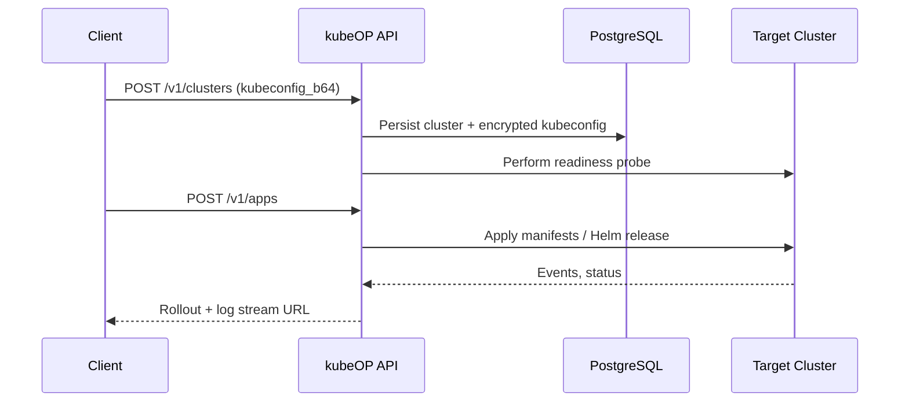

> **What this page explains**: The control-plane internals, flow of data, and cluster touch points.
> **Who it's for**: Architects and maintainers designing or extending kubeOP.
> **Why it matters**: Clarifies where services run, how they communicate, and what to scale.

# Control-plane design

kubeOP keeps the control plane out of the managed clusters. The API binary talks to PostgreSQL, reads encrypted kubeconfigs, and reaches clusters using Kubernetes client-go. Everything else is a library.

## Core components

- **API layer**: `chi` router with JWT middleware, RBAC checks, and REST handlers.
- **Scheduler**: periodic jobs that check cluster health, reconcile deployments, and rotate credentials.
- **Store**: PostgreSQL schema accessed via `pgx` with migration history tracked under `internal/store/migrations`.
- **Logging**: `zap` JSON output with `lumberjack` rotation, emitted to stdout and disk.

## Data flow



## Kubernetes integration

### Credentials
Stored kubeconfigs remain base64 encoded and encrypted at rest with `internal/crypto`. kubeOP issues service-account kubeconfigs scoped via RBAC templates before handing them to tenants.

### Workload targets
Deployments run via the Kubernetes API, Helm SDK, or plain manifest apply. The scheduler reconciles desired state, handles rollbacks, and emits events for external notification hooks.

```go
client := platform.NewClusterClient(ctx, clusterID)
if err := client.ApplyManifest(ctx, manifestBytes); err != nil {
    return fmt.Errorf("apply manifest: %w", err)
}
```

## Scaling notes

### Stateless API pods
Because all state lives in PostgreSQL, you can scale the API horizontally. Use Redis or PostgreSQL advisory locks if you introduce distributed background jobs.

### Cluster fan-out
Sharding clusters by team or environment can reduce credential blast radius. Each cluster object defines rate limits for watch streams, ensuring kubeOP never overwhelms the API server.

