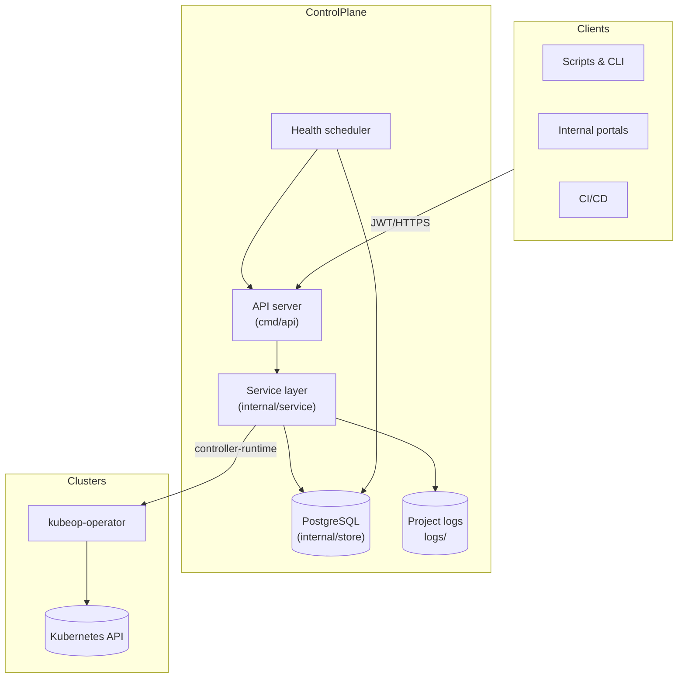
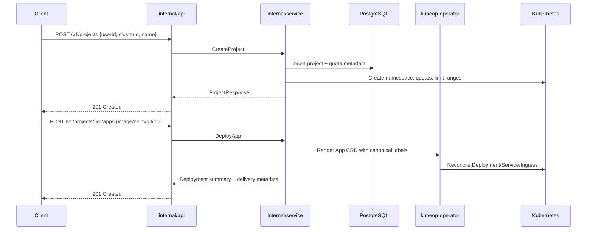

# Architecture

kubeOP keeps the control plane outside your clusters and relies on a single set of canonical labels to keep workloads correlated. This document explains the major components, data flow, and operational touch points.

## Component overview

- **API (`cmd/api`)** – exposes `/v1` endpoints with chi, performs authentication, validation, and emits structured logs.
- **Service layer (`internal/service`)** – orchestrates PostgreSQL queries, renders manifests, pushes to Kubernetes, and records delivery summaries.
- **Store (`internal/store`)** – wraps pgx with explicit queries per resource.
- **Scheduler (`internal/service/healthscheduler.go`)** – records health snapshots for every registered cluster on a fixed cadence.
- **Operator (`kubeop-operator/`)** – reconciles rendered `App` custom resources to keep in-cluster state aligned.
- **Project logs** – each project receives its own log directory under `logs/<project-id>`; the service ensures existence at startup.

## Request lifecycle

All Kubernetes resources emitted by kubeOP include the canonical label set produced by `service.CanonicalAppLabels`. The `kubeop.app.id` label is the primary selector for Deployments, Services, Ingresses, and pod log streaming.

## Data storage

- **PostgreSQL** – clusters, users, projects, apps, quotas, releases, credentials, events, and scheduler snapshots.
- **Filesystem (`logs/`)** – append-only per-project logs, delivery metadata archives, and rotated gzip bundles.

## Background jobs

- **Cluster health scheduler** – runs every `CLUSTER_HEALTH_INTERVAL_SECONDS` (default 60s) and persists API reachability, version, and node counts. Results surface via `/v1/clusters/{id}/status`.
- **Project log preparation** – executed during service startup to create directories and rotate stale files.

## In-cluster operator

The bundled `kubeop-operator` uses controller-runtime. It watches `App` resources, renders Deployments/StatefulSets/Services/Ingresses, and sets status conditions that surface through the API. Operator settings (namespace, image, leader election) are controlled through `OPERATOR_*` environment variables.

## Observability

- Every HTTP request receives a request-scoped logger with a correlation ID.
- `/metrics` exposes Prometheus counters for request totals, readyz failures, and scheduler timing.
- `/v1/version` emits immutable build metadata (version, commit, date). Deprecated build windows were removed in v0.14.0—upgrade policies now rely on SemVer alone.

## Trust boundaries

- kubeOP never stores plaintext kubeconfigs; values are encrypted with `KCFG_ENCRYPTION_KEY`.
- Admin endpoints require JWTs signed with `ADMIN_JWT_SECRET` unless `DISABLE_AUTH=true` (development only).
- The control plane may run outside Kubernetes; restrict inbound traffic with your load balancer or ingress of choice, and ensure outbound access to managed cluster APIs.
