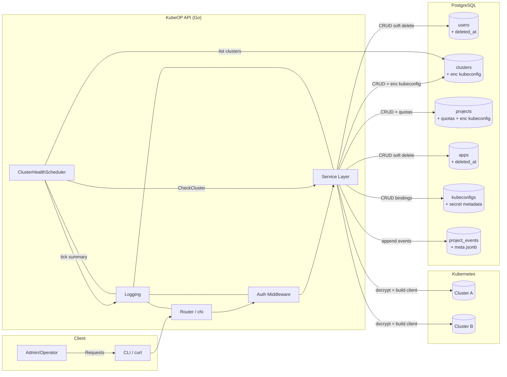
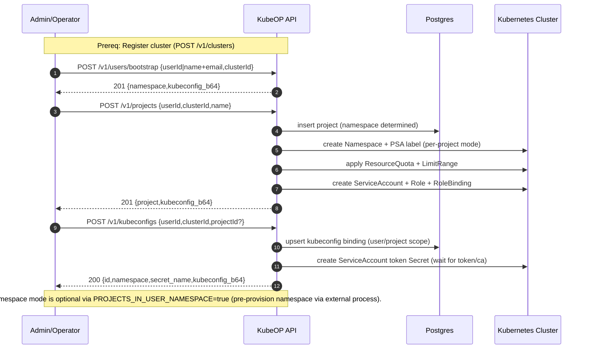
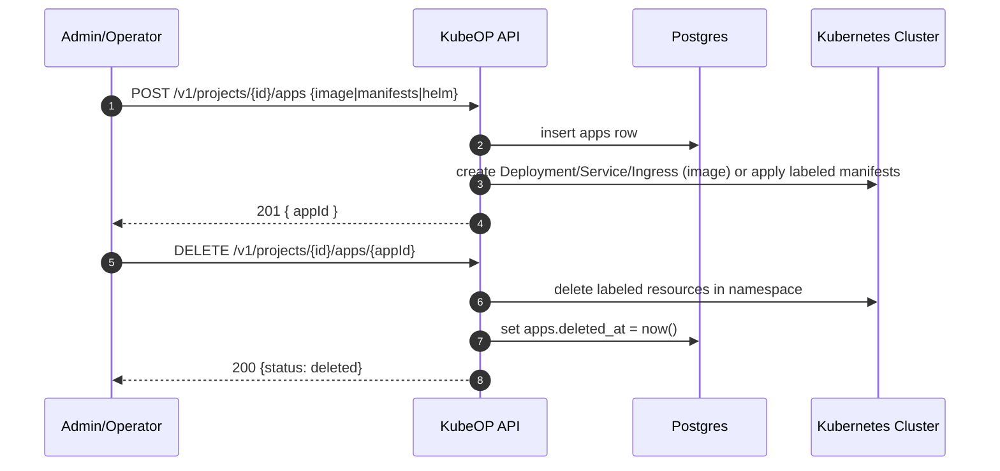

Architecture

High-Level

- Out-of-cluster Go service exposing a REST API on port 8080.
- PostgreSQL stores users, clusters, projects, apps, kubeconfig bindings, and project events. Kubeconfigs and metadata are encrypted at rest where noted.
- Multi-cluster: controller-runtime client per cluster, constructed from stored kubeconfigs on demand. A simple in-memory cache avoids rebuilding clients repeatedly.
  Project provisioning: by default (v0.1.2), projects live in a user namespace (shared mode). You can switch to per-project namespaces by setting `PROJECTS_IN_USER_NAMESPACE=false`.

Packages

- `cmd/api`: main entrypoint; wires config, logging, store, service, and HTTP router.
- `cmd/kubeop-watcher`: informer-driven bridge streaming labelled
  resource changes into kubeOP’s ingest endpoint.
- `internal/config`: loads env and optional YAML config file (via `CONFIG_FILE`).
- `internal/logging`: builds zap-based JSON loggers with stdout + rotating file sinks.
- `internal/crypto`: AES-GCM utilities and key derivation from env.
- `internal/store`: database connection and embedded SQL migrations; CRUD for users/clusters/projects/apps/events.
- `internal/service/events.go`: normalises and records project events, redacting sensitive metadata before API responses.
- `internal/service`: business logic (encrypting kubeconfigs, validation) and DB orchestration.
- `internal/watcherdeploy`: renders Kubernetes manifests and readiness checks
  for the optional auto-deployed watcher bridge.
- `internal/service/healthscheduler.go`: reusable cluster health scheduler helper with bounded tick timeouts.
- `internal/service/manifests.go`: shared builders for NetworkPolicies and namespace RBAC to avoid drift.
- `internal/api`: HTTP router (chi), endpoints, auth middleware, health checks.
- `internal/kube`: multi-cluster client manager using controller-runtime + client-go.
- `internal/version`: build-time versioning variables.

Out-of-Cluster Design

- Runs as a container or standalone binary; no in-cluster permissions needed.
- Kubeconfigs for managed clusters are uploaded and stored encrypted; controller-runtime clients are initialized from decrypted kubeconfigs only when needed.
- The watcher bridge reuses kubeconfigs issued during cluster
  registration, persisting resource versions locally and delivering
  deduplicated batches to kubeOP over HTTPS with retry/backoff.
  When `WATCHER_AUTO_DEPLOY=true`, the API provisions the watcher deployment,
  RBAC, and supporting Secret/volume on registration and waits for readiness
  before returning.

Client Cache

- The `kube.Manager` caches `controller-runtime` clients keyed by cluster ID. If not present, it loads and decrypts the kubeconfig and constructs a new client.
- Cache invalidation is simple and in-memory for now; future phases can add TTLs, eviction, and metrics.

Extensibility

- Service layer is the pivot for adding tenants/projects/apps and future controllers.
- Endpoint and request types are versioned under `/v1` for now.

Diagram

User Flow

Apps Flow

Background Scheduler

- `ClusterHealthScheduler` pulls cluster IDs from the store, runs `Service.CheckCluster` with per-tick timeouts, and logs a summary per execution.
- Future enhancements (see roadmap) will export Prometheus metrics from this helper.

Deletion

- All deletes use soft-delete in DB (set deleted_at) and remove Kubernetes resources where applicable.
