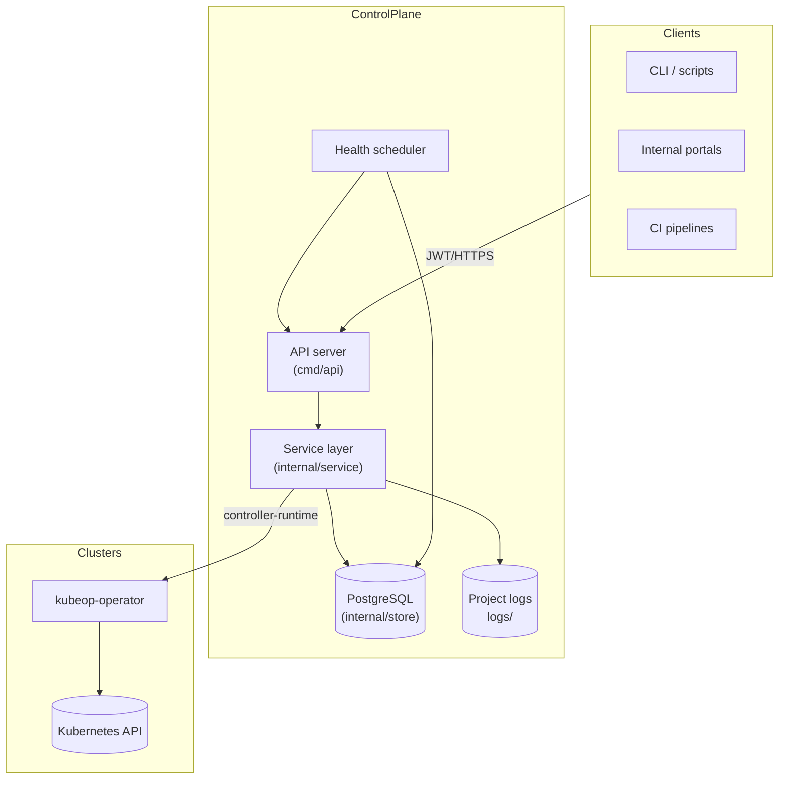
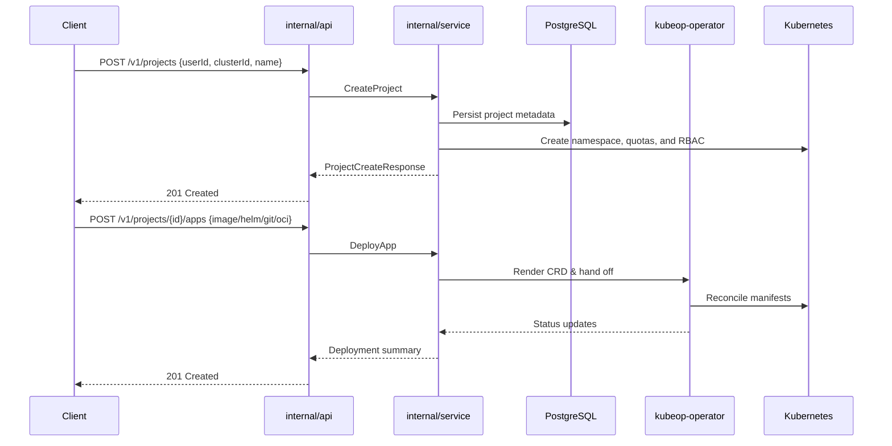

# Architecture

kubeOP keeps the control plane outside your clusters. This document explains the components, data flow, and operational
boundaries so you can reason about upgrades and integrations.

## Component overview

The API (Go + `chi`) performs request authentication, validation, and auditing. The service layer orchestrates store queries,
Kubernetes interactions, and log writing. The scheduler continuously refreshes cluster health snapshots and persists them for API
consumers. Within each managed cluster, the `kubeop-operator` reconciles `App` CRDs rendered by the service layer.

The Mermaid source and exported diagrams live in `docs/media/`.

## Request lifecycle

## Data storage

- **PostgreSQL** – clusters, users, projects, apps, credential stores, templates, events, and scheduler snapshots.
- **Filesystem (`logs/`)** – append-only per-project logs, application delivery records, and user-accessible archives.
- **OpenAPI schema** – published at [`docs/openapi.yaml`](openapi.yaml) and surfaced via `/v1/openapi`.

## Background jobs

- **Cluster health scheduler** (`internal/service/healthscheduler.go`) runs at `CLUSTER_HEALTH_INTERVAL_SECONDS` and records the
  latest probe results. Responses surface through `/v1/clusters/{id}/status`.
- **Log maintenance** (`internal/service/logs.go`) rotates project logs and ensures directories exist at startup.

## Extensibility points

- **Delivery engines** – `internal/service/apps.go` supports container images, Helm charts, Git repos, and OCI bundles. New
  delivery types plug into this module.
- **DNS providers** – `internal/service/dns/*.go` implements Cloudflare and PowerDNS integrations controlled by environment
  variables.
- **Operator hooks** – `kubeop-operator/` uses controller-runtime; add new reconcilers or CRDs as required.

## Trust boundaries

- kubeOP never stores plaintext kubeconfigs; they are encrypted with `KCFG_ENCRYPTION_KEY` and decrypted only in memory.
- All admin actions require JWTs signed with `ADMIN_JWT_SECRET` unless `DISABLE_AUTH=true` (development only).
- The API can run outside Kubernetes; ensure outbound network access to cluster API servers and inbound access is restricted via
  your chosen ingress/load balancer.
