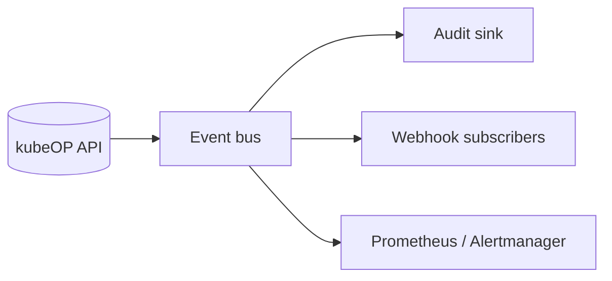

> **What this page explains**: kubeOP logging and event distribution.
> **Who it's for**: Observability and SRE teams integrating the platform.
> **Why it matters**: Shows how to capture, ship, and monitor runtime signals.

# Logs and events

kubeOP emits JSON logs, audit trails, and Kubernetes events so you can stitch the picture together quickly.

## Logging outputs

### API logs
Application logs stream to stdout and `${LOGS_ROOT}/api.log` with correlation IDs.

```json
{
  "level": "info",
  "ts": "2024-02-01T12:45:32.123Z",
  "logger": "http",
  "msg": "POST /v1/apps",
  "request_id": "3d6e8d7b-92b3-4fcb-9306-f6f7c041d3fb",
  "tenant": "payments",
  "status": 202,
  "duration_ms": 184
}
```

### Project/app logs
Per-project directories live under `${LOGS_ROOT}/projects/<project_id>/apps/<app_id>/`. Subdirectories mirror revision numbers so you can stream historic outputs.

## Audit events

### Format
Audit entries capture mutating API calls with redacted secrets.

```json
{
  "kind": "audit",
  "actor": "alice@example.com",
  "action": "create_app",
  "resource": "apps/6f1d",
  "request_id": "3d6e8d7b-92b3-4fcb-9306-f6f7c041d3fb"
}
```

### Shipping
Forward logs to Loki, Elastic, or CloudWatch using Fluent Bit tailing the filesystem. Each record already includes `tenant`, `project`, and `revision` labels.

## Event plumbing



### Webhooks
Configure webhook targets per tenant or project. kubeOP batches events and retries with exponential backoff so you can plug into Slack or incident tools without manual polling.

### Metrics
`/metrics` exposes Prometheus counters for API latency, scheduler runs, and cluster health. Dashboards usually chart `kubeop_scheduler_cluster_probe_failure_total` and `kubeop_app_rollout_seconds`.

