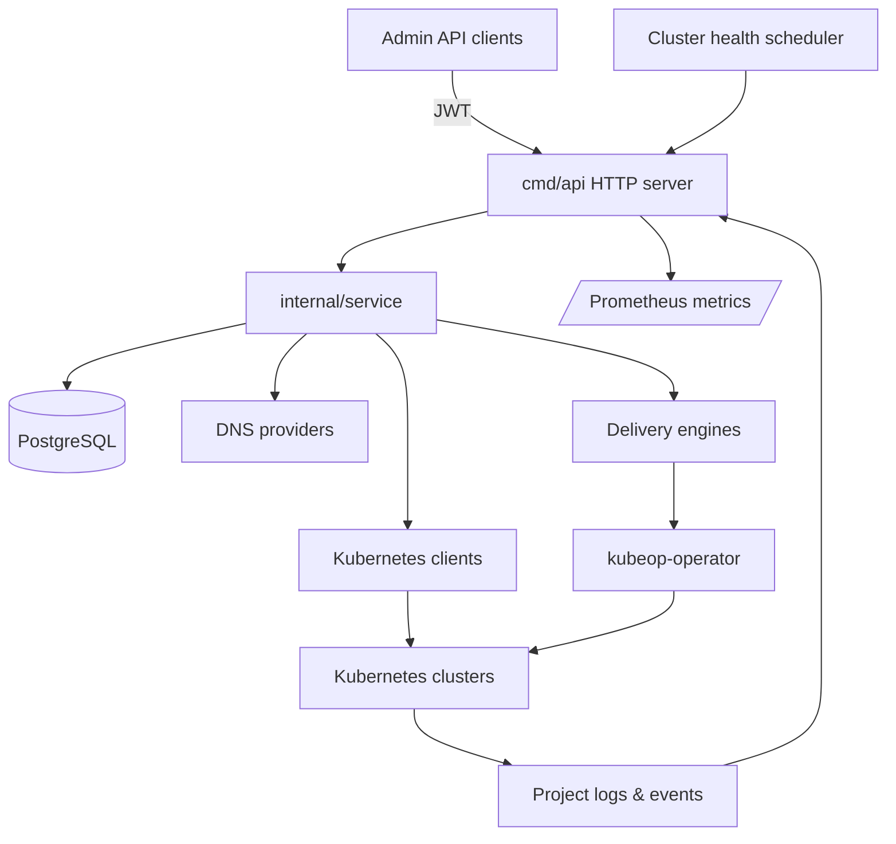

```mermaid
graph TD
  Admin[Admin API clients] -->|JWT| API
  Scheduler[Cluster health scheduler] --> API
  API[cmd/api HTTP server] --> Service[internal/service]
  Service --> Store[(PostgreSQL)]
  Service --> KubeManager[Kubernetes clients]
  Service --> DNS[DNS providers]
  Service --> Delivery[Delivery engines]
  KubeManager --> ManagedClusters[Kubernetes clusters]
  Delivery --> Operator[kubeop-operator]
  Operator --> ManagedClusters
  ManagedClusters --> Logs[Project logs & events]
  Logs --> API
  API --> Metrics[/Prometheus metrics/]
```
