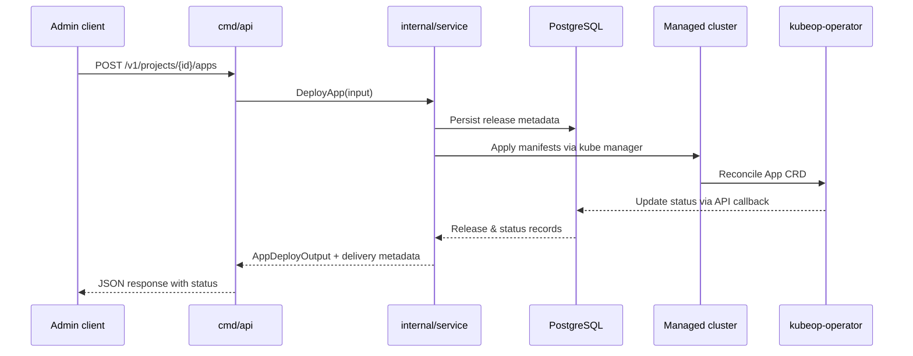

```mermaid
sequenceDiagram
  participant Admin as Admin client
  participant API as cmd/api
  participant Service as internal/service
  participant Store as PostgreSQL
  participant Cluster as Managed cluster
  participant Operator as kubeop-operator

  Admin->>API: POST /v1/projects/{id}/apps
  API->>Service: DeployApp(input)
  Service->>Store: Persist release metadata
  Service->>Cluster: Apply manifests via kube manager
  Cluster->>Operator: Reconcile App CRD
  Operator-->>Store: Update status via API callback
  Store-->>Service: Release & status records
  Service-->>API: AppDeployOutput + delivery metadata
  API-->>Admin: JSON response with status
```
