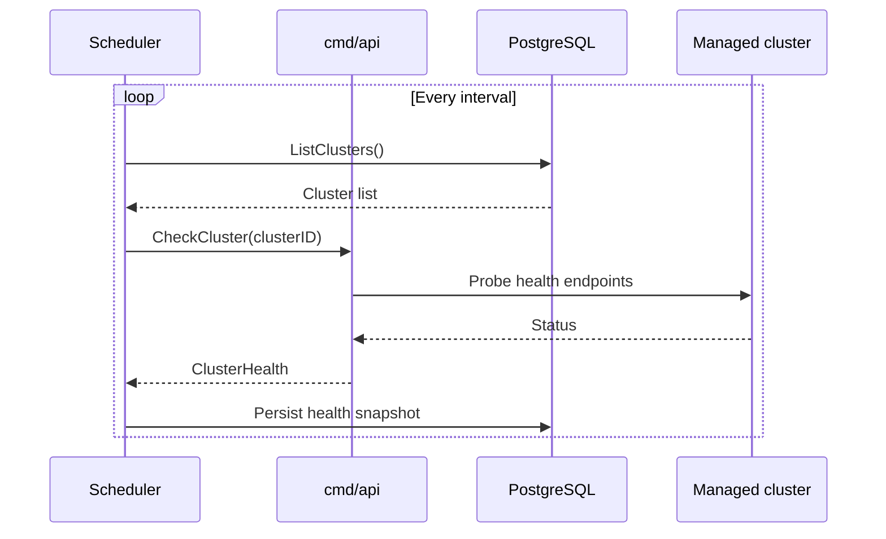

```mermaid
sequenceDiagram
  participant Scheduler as Scheduler
  participant API as cmd/api
  participant Store as PostgreSQL
  participant Cluster as Managed cluster

  loop Every interval
    Scheduler->>Store: ListClusters()
    Store-->>Scheduler: Cluster list
    Scheduler->>API: CheckCluster(clusterID)
    API->>Cluster: Probe health endpoints
    Cluster-->>API: Status
    API-->>Scheduler: ClusterHealth
    Scheduler->>Store: Persist health snapshot
  end
```
