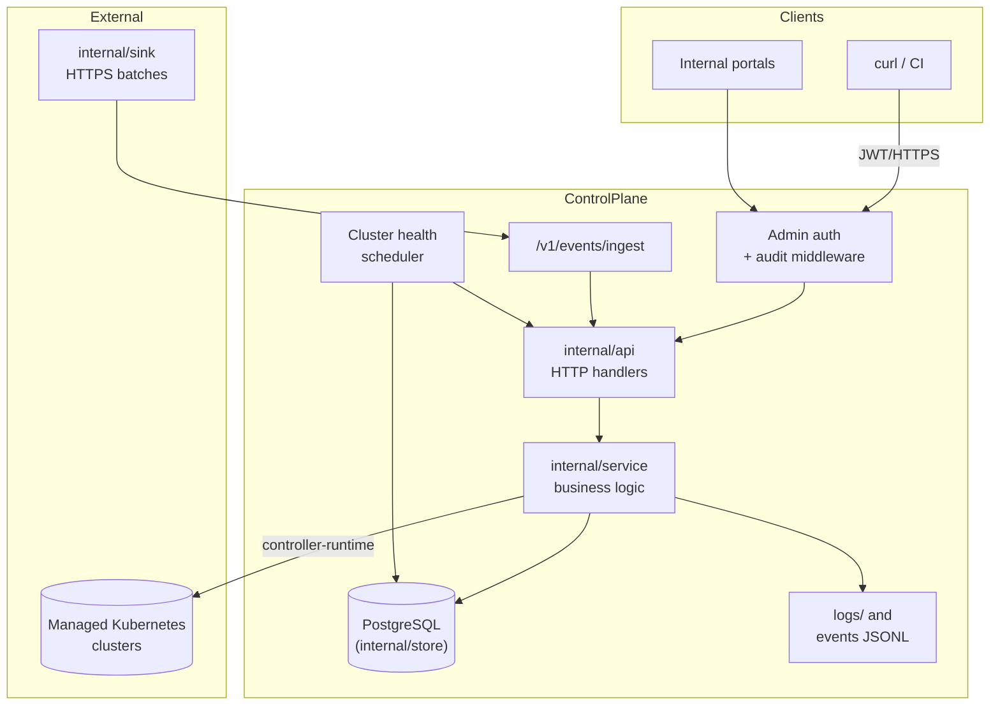
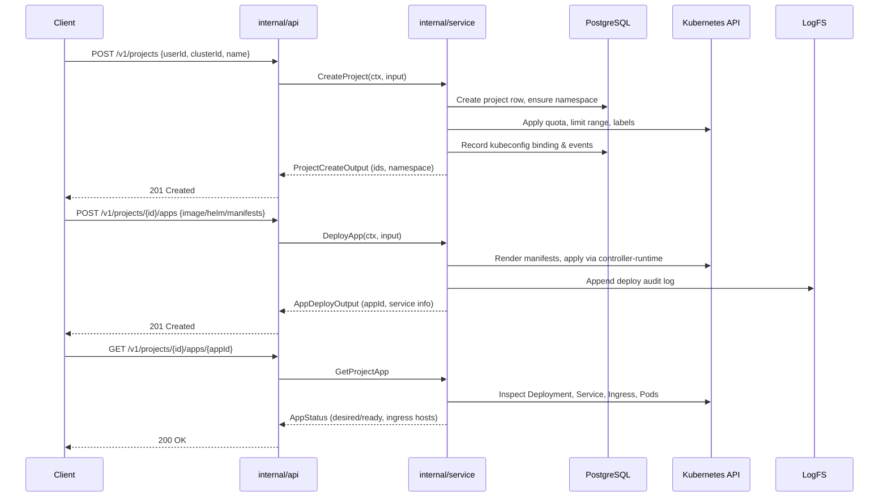

# Architecture

kubeOP keeps the control plane outside managed clusters. It authenticates every admin call, persists state in PostgreSQL, and reconciles Kubernetes resources on demand. This page outlines the core concepts, data flows, and diagrams that describe the system.

## Domain concepts

## Repository assets

- `cmd/api` — HTTP server entrypoint.
- `internal/` — business logic, stores, and integrations.
- `samples/` — reusable shell automation scaffolding with shared logging helpers (`samples/lib/common.sh`).


| Concept | Description |
| --- | --- |
| Tenant | Logical owner of namespaces and projects. Tenants are represented by users bootstrapped through `/v1/users/bootstrap`, which provisions dedicated namespaces and kubeconfigs. |
| Cluster | Registered Kubernetes target (stored via `internal/store/clusters.go`). kubeOP stores encrypted kubeconfigs plus ownership metadata (owner, environment, region, tags) and persists health snapshots for `/v1/clusters` inventory views. |
| Project | Application workspace tied to a user namespace (`internal/store/projects.go`). Projects receive quotas, limit ranges, and managed annotations and can be suspended or deleted. |
| App | Deployed workload associated with a project. The service layer renders Deployments, Services, Ingresses, Jobs, or raw manifests depending on the payload (`internal/service/apps.go`). |
| Quota profile | Default ResourceQuota and LimitRange values derived from configuration (`internal/service/quota.go`, `internal/config/config.go`). |

## High-level architecture



## Request lifecycle




## Deployment topology

```mermaid
flowchart TB
    subgraph Operator Network
        ControlPlane[Control plane VM / container]
        Postgres[(PostgreSQL 14+)]
        ObjectStorage[(Optional log archive)]
    end
    subgraph Cluster A
        TenantNamespacesA[(Tenant namespaces)]
    end
    subgraph Cluster B
        TenantNamespacesB[(Tenant namespaces)]
    end

    ControlPlane -->|TCP 5432| Postgres
    ControlPlane -->|HTTPS :8080| Internet
    ControlPlane -->|kubectl via kubeconfig| TenantNamespacesA
    ControlPlane --> TenantNamespacesB
    ControlPlane -->|Log rotation| ObjectStorage

    subgraph Future Operator (Preview)
        Operator["kubeop-operator\n(controller-runtime)"]
    end

    Operator --> TenantNamespacesA
    Operator --> TenantNamespacesB
```

## Data and control flows

### API and middleware

- `internal/api/router.go` registers health/readiness/version endpoints, wraps all `/v1` routes with `AdminAuthMiddleware`, and emits audit/structured logs. Health checks defer to a pluggable interface so the scheduler and store dependencies surface errors quickly.
- `/v1/events/ingest` receives batches from the optional Kubernetes event bridge (`K8S_EVENTS_BRIDGE=true`) and returns accepted/dropped counts with error indexes so collectors can retry failures without parsing logs.

### Service layer

- `internal/service/apps.go` renders workloads from multiple input types (image, Helm chart, raw manifests, Git repositories, OCI bundles), validates ports and domains, and reconciles Kubernetes resources via controller-runtime clients while recording commit hashes and artifact digests for release history.
- `internal/service/configs.go`, `secrets.go`, and `events.go` manage ConfigMap/Secret lifecycles and persist project events through the store.
- `internal/service/kubeconfigs.go` encrypts kubeconfigs, rotates tokens, and maintains per-user/project bindings with namespace-scoped RBAC.
- `internal/service/maintenance.go` stores the global maintenance toggle and guards mutating operations (cluster registration,
  project/app changes, template deploys) so upgrades can pause API writes safely.

### Persistence and logs

- `internal/store` packages wrap PostgreSQL queries for clusters, users, projects, apps, kubeconfig bindings, and events. Pagination, cursoring, and filters ensure API responses stay bounded.
- `internal/store/maintenance.go` and migration `0020_create_maintenance_state` persist the maintenance toggle with actor/timestamp
  metadata that is reused across API replicas.
- `internal/logging` writes request/audit logs and per-project append-only files under `logs/projects/<id>/`. Tail handlers stream data without loading entire files into memory.

### Scheduler and readiness

- `internal/service/healthscheduler.go` runs periodic health ticks against registered clusters, capturing status summaries exposed via `/v1/clusters/health` and `/v1/clusters/{id}/health` while persisting results to `/v1/clusters/{id}/status`.


### Operator (preview)

- `kubeop-operator/` provides the initial controller-runtime manager with an `App` CRD scaffold. The manager exposes health and readiness probes, metrics, and leader election hooks while logging reconcile activity with zap. Future phases will extend the operator with additional CRDs and full workload reconciliation before cutting over from the legacy watcher.


kubeOP keeps all automation within explicit services so operators can audit, extend, or disable components without redeploying controllers inside target clusters.
