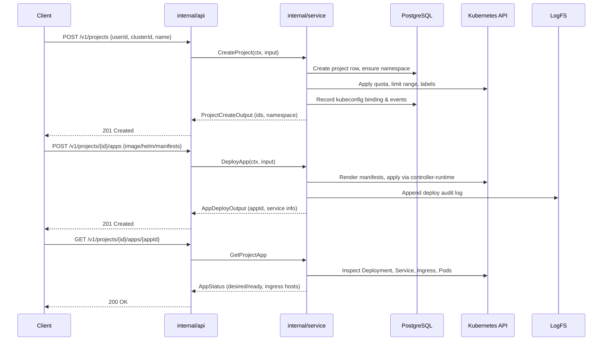
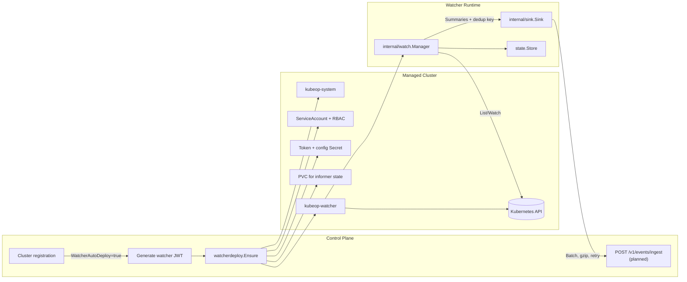
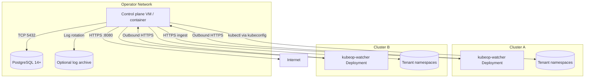

# Architecture

kubeOP keeps the control plane outside managed clusters. It authenticates every admin call, persists state in PostgreSQL, and reconciles Kubernetes resources on demand. This page outlines the core concepts, data flows, and diagrams that describe the system.

## Domain concepts

| Concept | Description |
| --- | --- |
| Tenant | Logical owner of namespaces and projects. Tenants are represented by users bootstrapped through `/v1/users/bootstrap`, which provisions dedicated namespaces and kubeconfigs. |
| Cluster | Registered Kubernetes target (stored via `internal/store/clusters.go`). kubeOP stores encrypted kubeconfigs and uses them to create controller-runtime clients per request. |
| Project | Application workspace tied to a user namespace (`internal/store/projects.go`). Projects receive quotas, limit ranges, and managed annotations and can be suspended or deleted. |
| App | Deployed workload associated with a project. The service layer renders Deployments, Services, Ingresses, Jobs, or raw manifests depending on the payload (`internal/service/apps.go`). |
| Watcher | Out-of-cluster deployment that streams filtered Kubernetes resource changes back to kubeOP via the batching sink (`cmd/kubeop-watcher`, `internal/watch`). |
| Quota profile | Default ResourceQuota and LimitRange values derived from configuration (`internal/service/quota.go`, `internal/config/config.go`). |

## High-level architecture

```mermaid
flowchart TD
    subgraph Clients
        CLI["curl / CI"]
        Integrations["Internal portals"]
    end
    subgraph ControlPlane
        API["internal/api<br/>HTTP handlers"]
        MW["Admin auth<br/>+ audit middleware"]
        Service["internal/service<br/>business logic"]
        Store[("PostgreSQL<br/>(internal/store)")]
        Scheduler["Cluster health<br/>scheduler"]
        LogFS["logs/<project> and<br/>events JSONL"]
    end
    subgraph External
        Clusters[("Managed Kubernetes<br/>clusters")]
        WatcherDeploy["watcherdeploy<br/>manifest orchestrator"]
        WatcherProc["kubeop-watcher<br/>Deployment"]
        Sink["internal/sink<br/>HTTPS batches"]
    end
    CLI -->|JWT/HTTPS| MW --> API
    Integrations --> MW
    API --> Service
    Service --> Store
    Service -->|controller-runtime| Clusters
    Service --> LogFS
    Service -->|auto deploy manifests| WatcherDeploy --> WatcherProc --> Sink -->|POST /v1/events/ingest (planned)| API
    Scheduler --> Store
    Scheduler --> API
```

## Request lifecycle



## Watcher sync pipeline



## Deployment topology



## Data and control flows

### API and middleware

- `internal/api/router.go` registers health/readiness/version endpoints, wraps all `/v1` routes with `AdminAuthMiddleware`, and emits audit/structured logs. Health checks defer to a pluggable interface so the scheduler and store dependencies surface errors quickly.

### Service layer

- `internal/service/apps.go` renders workloads from multiple input types (image, Helm chart, raw manifests), validates ports and domains, and reconciles Kubernetes resources via controller-runtime clients.
- `internal/service/configs.go`, `secrets.go`, and `events.go` manage ConfigMap/Secret lifecycles and persist project events through the store.
- `internal/service/kubeconfigs.go` encrypts kubeconfigs, rotates tokens, and maintains per-user/project bindings with namespace-scoped RBAC.

### Persistence and logs

- `internal/store` packages wrap PostgreSQL queries for clusters, users, projects, apps, kubeconfig bindings, and events. Pagination, cursoring, and filters ensure API responses stay bounded.
- `internal/logging` writes request/audit logs and per-project append-only files under `logs/projects/<id>/`. Tail handlers stream data without loading entire files into memory.

### Scheduler and readiness

- `internal/service/healthscheduler.go` runs periodic health ticks against registered clusters, capturing status summaries exposed via `/v1/clusters/health` and `/v1/clusters/{id}/health`.

### Watcher pipeline

- `internal/watch/manager.go` builds dynamic informers for allowed kinds, persists resource versions to `internal/state`, and enforces label selectors + required keys to filter tenant workloads.
- `internal/sink/sink.go` batches events (max 200, 1s window), gzips payloads above 8 KiB, deduplicates via UID/resourceVersion, and retries with exponential backoff (250ms to 30s).
- The watcher binary (`cmd/kubeop-watcher/main.go`) exposes `/healthz`, `/readyz`, and `/metrics` on `:8081`, runs the sink loop, and emits optional heartbeat events when configured.

### Auto-deployment

- During cluster registration, `internal/service/service.go` evaluates `WatcherAutoDeploy` from configuration. When enabled it builds a `watcherdeploy.Config` (namespace, RBAC, PVC, image, token) and waits for readiness before completing the API response.

kubeOP keeps all automation within explicit services so operators can audit, extend, or disable components without redeploying controllers inside target clusters.
