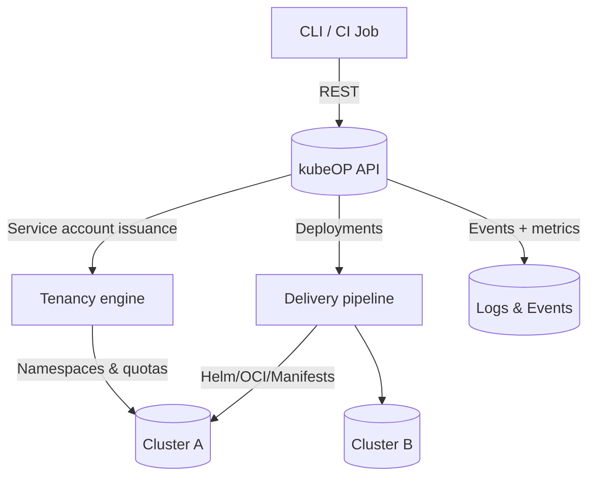

> **What this page explains**: kubeOP at a glance, why it exists, and how to run it fast.
> **Who it's for**: Platform engineers and SREs evaluating a multi-cluster control plane.
> **Why it matters**: Shows the value, the core features, and the 60-second bootstrap path.

# kubeOP

A friendly, out-of-cluster control plane that keeps tenant and application orchestration boring (in the good way). The project ships as a single API binary, automates Kubernetes tenancy, and stays observable by default.

## Feature highlights

<div class="cards">
  <div class="card"><strong>PaaS workflow</strong><br/>Opinionated tenants, projects, and apps that stay isolated yet easy to run.</div>
  <div class="card"><strong>Multi-cluster</strong><br/>Bring any kubeconfig, keep the fleet healthy, and direct workloads where they belong.</div>
  <div class="card"><strong>Helm & OCI</strong><br/>Deploy manifests, Helm charts, or OCI bundles with identical release tracking.</div>
  <div class="card"><strong>CI/CD ready</strong><br/>GitHub Actions, webhooks, and GitOps-friendly automation from the start.</div>
</div>

## Quick deploy

```bash
curl -L https://raw.githubusercontent.com/vaheed/kubeOP/main/docker-compose.yml -o docker-compose.yml
LOGS_ROOT=$PWD/logs docker compose up -d
```

## Platform flyover



## How it fits

### Control plane in your terms
kubeOP runs as a stateless HTTP API that talks to PostgreSQL and your Kubernetes clusters. No in-cluster agents, no CRDs, no unexpected controllers.

### Batteries for tenancy
Users, projects, quotas, and kubeconfig management are exposed through REST endpoints with automation hooks so you can script everything.

### Deploy anything
Ship raw YAML, Helm charts, or container releases. The platform records rollout status and streams logs per tenant.

### Observability by design
Structured logs, events, and metrics stay searchable without extra plumbing. Streaming hooks bridge into your SIEM of choice.

