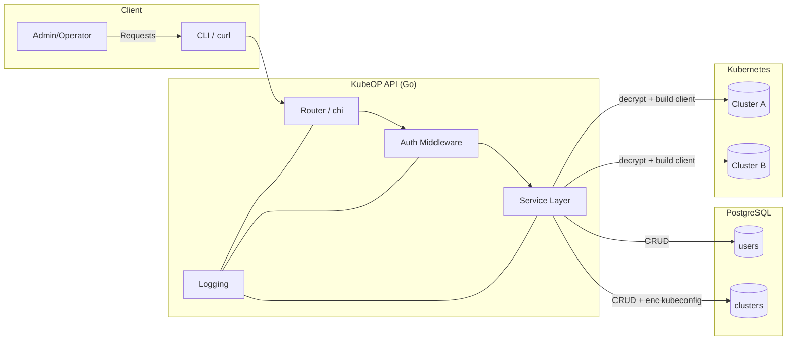

Architecture

High-Level

- Out-of-cluster Go service exposing a REST API on port 8080.
- PostgreSQL stores users and clusters. Kubeconfigs are encrypted at rest.
- Multi-cluster: controller-runtime client per cluster, constructed from stored kubeconfigs on demand. A simple in-memory cache avoids rebuilding clients repeatedly.

Packages

- `cmd/api`: main entrypoint; wires config, logging, store, service, and HTTP router.
- `internal/config`: loads env and optional YAML config file (via `CONFIG_FILE`).
- `internal/logging`: sets up JSON slog logger with level control.
- `internal/crypto`: AES-GCM utilities and key derivation from env.
- `internal/store`: database connection and embedded SQL migrations; CRUD for users/clusters.
- `internal/service`: business logic (encrypting kubeconfigs, validation) and DB orchestration.
- `internal/api`: HTTP router (chi), endpoints, auth middleware, health checks.
- `internal/kube`: multi-cluster client manager using controller-runtime + client-go.
- `internal/version`: build-time versioning variables.

Out-of-Cluster Design

- Runs as a container or standalone binary; no in-cluster permissions needed.
- Kubeconfigs for managed clusters are uploaded and stored encrypted; controller-runtime clients are initialized from decrypted kubeconfigs only when needed.

Client Cache

- The `kube.Manager` caches `controller-runtime` clients keyed by cluster ID. If not present, it loads and decrypts the kubeconfig and constructs a new client.
- Cache invalidation is simple and in-memory for now; future phases can add TTLs, eviction, and metrics.

Extensibility

- Service layer is the pivot for adding tenants/projects/apps and future controllers.
- Endpoint and request types are versioned under `/v1` for now.

Diagram

